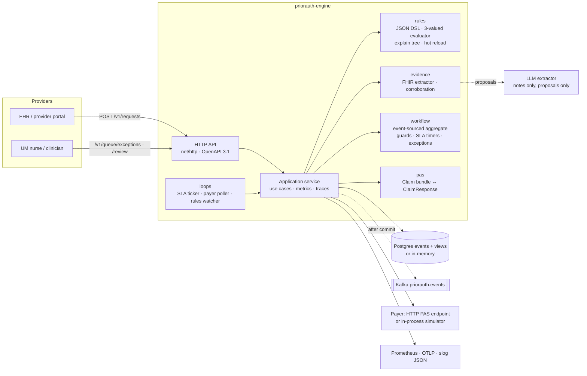
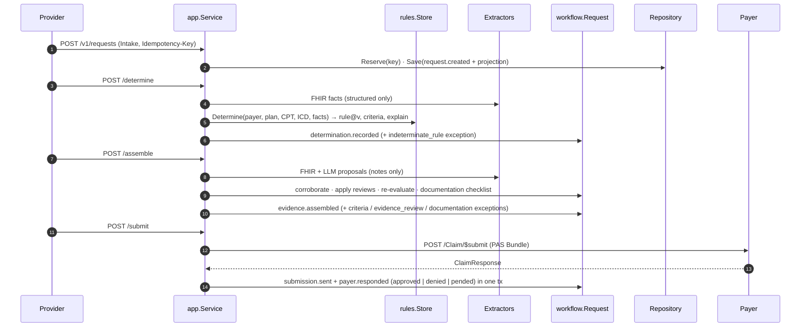

# priorauth-engine

> Prior authorization automation engine: deterministic coverage rules-as-code with explain trees, FHIR evidence assembly with a bounded LLM extractor, an event-sourced Draft→Determined→Assembled→Submitted→Pended/Approved/Denied→Appealed workflow with SLA timers, and Da Vinci PAS-shaped submission to a simulated payer.

[](go.mod)
[](LICENSE)
[](https://github.com/udaykishore-resu/priorauth-engine/actions/workflows/ci.yaml)

## Problem

Prior authorization is the most hated loop in US healthcare. A provider decides a patient
needs an MRI, a GLP-1 or twelve PT visits; a payer's medical policy says that service needs
approval first; and then a fax, a phone call or a portal session carries the request, a
nurse re-keys chart data into a form, the payer pends it for "medical review", the office
calls to check status, the denial arrives with a code nobody can decode, and the appeal
starts the loop again. The AMA's physician surveys put the cost at roughly two business
days of staff time per physician per week and a measurable rate of abandoned care.

It has resisted fixes because the three hard parts are usually attacked separately. Policy
is prose that changes quarterly and lives in PDFs, so "does this need auth?" is answered by
memory and phone trees. Evidence is scattered across coded resources and free-text notes,
so assembling a submission is a copy-paste job. And the workflow is long-lived, multi-party
and full of timers, so nobody can say where a request is or why it stalled. Standards
(Da Vinci CRD/DTR/PAS, CMS-0057-F) now define the *shapes* of the exchange, but a shape is
not an engine.

`priorauth-engine` is that engine, built the way a platform team would build it: a
deterministic rules core you can audit, an evidence pipeline where machine learning is a
quarantined proposer rather than a decider, and a state machine that records every step as
an event so a payer, a regulator or a tired UM nurse can see exactly what happened and why.

## Approach

- **Rules as code, three-valued.** Payer policies are small JSON documents
  (`rules/*.json`): payer/plan/service scope, `requires_auth`, a predicate tree over
  clinical facts (age, diagnosis codes, prior therapy tried, lab values with units) and the
  documentation the payer expects. The evaluator is deterministic and returns `met`,
  `not_met` or `unknown` ("the HbA1c is not on file" is not the same as "the HbA1c is
  6.1%"), plus an **explain tree** naming the fact IDs that decided each node. Rules are
  versioned (`id@version` and a set hash are recorded on every decision) and hot-reloaded.
- **Evidence with provenance.** A deterministic FHIR extractor turns `Condition`,
  `Observation`, `MedicationStatement` and `Procedure` resources into typed facts. An
  optional LLM extractor (any OpenAI-compatible endpoint) reads free-text notes **only** and
  emits *proposals* that must quote the note verbatim. The evaluator ignores proposals until
  a human confirms them or structured data corroborates them; this is enforced in one
  function (`evidence.Fact.Usable`), not in a prompt.
- **Event-sourced workflow.** Every request is an aggregate rebuilt from events with
  guarded transitions, SLA timers derived from its timeline, and an exceptions queue that
  always mirrors its state. The projection and the events commit in one transaction.
- **Standards-aligned submission.** Submissions are Da Vinci PAS-shaped FHIR `Claim`
  bundles; responses are `ClaimResponse` with X12 review action codes. A configurable
  payer simulator (`cmd/payer-sim`) makes pend/approve/deny/appeal testable with zero
  infrastructure. **X12 278 translation is out of scope** (that is a clearinghouse's job;
  the `PayerGateway` interface is where such an adapter plugs in).
- **Zero-dependency local run, real adapters for production.** Postgres (pgx) and Kafka
  (franz-go) adapters sit behind small interfaces next to in-memory ones, so `make run`
  and the whole test suite need nothing installed.

## Architecture



Hot path (`create → determine → assemble → submit`):



More in [docs/architecture.md](docs/architecture.md) (containers, state diagram, data model, scaling).

## Quick start

Requires Go 1.26+, `curl` and `jq`. No Docker, no database.

```bash
make run          # builds ./bin and starts on :8080 with in-memory storage + in-process payer simulator
```

In another terminal, run the full demo (`./examples/demo.sh`) or step through it by hand:

```bash
# 1. Create a request: 55-year-old with lumbar radiculopathy, 4 PT visits and a naproxen trial, asking for an MRI (CPT 72148)
ID=$(curl -s -X POST localhost:8080/v1/requests -H 'Content-Type: application/json' \
       --data @examples/01-mri-lumbar-spine.json | jq -r .id)

# 2. Deterministic determination: which rule fired, is auth required, are the criteria met, and why
curl -s -X POST localhost:8080/v1/requests/$ID/determine \
  | jq '{state, decision: .determination.decision, criteria: .determination.criteria, rule: .determination.rule_ref, explain: .determination.explain}'
#   → required · met · acme.imaging.mri-lumbar-spine@3  (explain tree: adult ✓, lumbar dx ✓, NSAID ≥ 42 days ✓)

# 3. Assemble the evidence package (facts with provenance + documentation checklist)
curl -s -X POST localhost:8080/v1/requests/$ID/assemble \
  | jq '{state, complete: .evidence.complete, facts: (.evidence.facts|length), docs: [.evidence.documentation[] | {code, satisfied}]}'

# 4. Submit the PAS Claim bundle to the payer; the simulator approves a well-documented request immediately
curl -s -X POST localhost:8080/v1/requests/$ID/submit | jq '{state, payer_ref: .submission.payer_ref, auth: .decision.auth_number}'

# 5. Human loop: an urgent MRI with unknown criteria lands on the exceptions queue; a clinician overrides, then it submits and is pended
REV=$(curl -s -X POST localhost:8080/v1/requests -H 'Content-Type: application/json' --data @examples/04-mri-needs-review.json | jq -r .id)
curl -s -X POST localhost:8080/v1/requests/$REV/determine > /dev/null
curl -s -X POST localhost:8080/v1/requests/$REV/assemble  | jq '{state, exceptions: [.exceptions[]?.code], missing: .evidence.missing_data}'
curl -s localhost:8080/v1/queue/exceptions | jq '.items[] | {request_id, urgent, code: .exception.code, suggested_action}'
curl -s -X POST localhost:8080/v1/requests/$REV/review -H 'Content-Type: application/json' --data @examples/review-override.json | jq '{state, override_by: .override.actor}'
curl -s -X POST localhost:8080/v1/requests/$REV/assemble > /dev/null
curl -s -X POST localhost:8080/v1/requests/$REV/submit | jq '{state}'         # → pended (thin evidence)
curl -s -X POST localhost:8080/v1/requests/$REV/sync   | jq '{state}'         # → approved (payer status inquiry)

# 6. Audit trail, turnaround metrics, active rules
curl -s localhost:8080/v1/requests/$ID/events | jq '[.events[] | {seq, type, actor}]'
curl -s localhost:8080/v1/metrics/turnaround | jq '{total, by_state, decided, auto_determined_ratio, payer_outcomes}'
curl -s localhost:8080/v1/rules | jq '{hash, rules: [.rules[] | {id, version, requires_auth}]}'
```

Other flows worth trying:

- **Denial → appeal**: `PA_PAYER_SIM_MODE=deny make run`, run steps 1–4, then
  `POST /v1/requests/$ID/review --data @examples/review-appeal.json` and `POST .../submit` again.
- **Hot reload**: drop a JSON file into `rules/` while running; `GET /v1/rules` shows the new hash
  within `PA_RULES_RELOAD_INTERVAL`, and an invalid file is rejected without touching the active set.
- **Standalone payer**: `make run-sim` (port 8081) and `PA_PAYER=http PA_PAYER_BASE_URL=http://localhost:8081 make run`.
- **Full stack**: `make run-full` brings up Postgres, Kafka (KRaft), an OTel collector and the
  payer simulator with docker compose and runs the engine against them.
- **LLM proposals**: set `PA_LLM_BASE_URL` (+ `PA_LLM_API_KEY`, `PA_LLM_MODEL`) to any
  OpenAI-compatible endpoint. Example 04 carries a note describing 8 PT sessions and a foot
  drop; proposals appear as `evidence_review` exceptions until confirmed via
  `POST /review {"action":"confirm_evidence","fact_ids":[...]}`.

The API is described in [api/openapi.yaml](api/openapi.yaml).

## Configuration

All configuration is by environment variable. Secrets (`PA_POSTGRES_DSN`, `PA_LLM_API_KEY`)
are never in the repo; the Helm chart reads them from an existing Secret.

| Variable | Default | Description |
| --- | --- | --- |
| `PA_HTTP_ADDR` | `:8080` | Listen address |
| `PA_LOG_LEVEL` | `info` | `debug` / `info` / `warn` / `error` (JSON to stderr) |
| `PA_VERSION` | `dev` | Reported by `/healthz` and traces |
| `PA_SHUTDOWN_TIMEOUT` | `20s` | Drain window after SIGTERM |
| `PA_HTTP_READ_TIMEOUT` / `PA_HTTP_WRITE_TIMEOUT` | `15s` / `60s` | Server timeouts |
| `PA_HTTP_MAX_BODY_BYTES` | `8388608` | Request body limit (FHIR bundles can be large) |
| `PA_RULES_DIR` | `./rules` | Directory of rule JSON files |
| `PA_RULES_RELOAD_INTERVAL` | `5s` | Hot-reload poll interval |
| `PA_STORAGE` | `memory` | `memory` or `postgres` |
| `PA_POSTGRES_DSN` | | Required for `postgres`; migrations run at start-up |
| `PA_EVENTS` | `memory` | `memory` or `kafka` |
| `PA_KAFKA_BROKERS` | `localhost:9092` | Comma-separated seed brokers |
| `PA_KAFKA_TOPIC` | `priorauth.events` | Topic; records keyed by request id |
| `PA_PAYER` | `sim` | `sim` (in-process simulator) or `http` |
| `PA_PAYER_BASE_URL` | `http://localhost:8081` | PAS endpoint base (`/Claim/$submit`, `/ClaimResponse/{ref}`) |
| `PA_PAYER_TIMEOUT` | `10s` | Per-call timeout (2 retries with backoff on 5xx/transport) |
| `PA_PAYER_SIM_MODE` | `smart` | `smart` / `approve` / `deny` / `pend` / `random` |
| `PA_PAYER_SIM_LATENCY` | `0` | Simulated payer latency |
| `PA_PAYER_POLL_INTERVAL` | `30s` | How often pended requests are synced with the payer |
| `PA_LLM_BASE_URL` | | Enables the LLM extractor when set (OpenAI-compatible `/v1/chat/completions`) |
| `PA_LLM_API_KEY` / `PA_LLM_MODEL` / `PA_LLM_TIMEOUT` | / `gpt-4o-mini` / `30s` | LLM extractor settings |
| `PA_SLA_DETERMINE` | `4h` | Draft without determination |
| `PA_SLA_ASSEMBLE` | `24h` | Required without evidence package |
| `PA_SLA_SUBMIT` | `24h` | Assembled without submission |
| `PA_SLA_RESPONSE` | `72h` | Submitted (or appeal) without payer answer |
| `PA_SLA_PENDED` | `168h` | Pended without final decision |
| `PA_SLA_REVIEW` | `48h` | Exception open without human action |
| `PA_SLA_URGENT_FACTOR` | `0.25` | Deadline multiplier for `service.urgent` requests |
| `PA_SLA_TICK` | `1m` | SLA check interval |
| `PA_OTLP_ENDPOINT` | | OTLP/HTTP traces endpoint (empty = tracing without export) |
| `PA_OTLP_INSECURE` | `true` | Plain HTTP to the collector |

Payer simulator (`cmd/payer-sim`): `SIM_HTTP_ADDR`, `SIM_MODE`, `SIM_LATENCY`, `SIM_PEND_FLIPS`,
`SIM_ERROR_RATE`, `SIM_DENY_REASON`, `SIM_LOG_LEVEL`; `PUT /admin/mode`, `GET /admin/stats`,
and an `X-Sim-Decision: approve|deny|pend` header per request.

## Operations

- **SLOs**: 99.9 % non-5xx availability; determine p95 < 250 ms; submit p95 < 500 ms excluding
  payer time; auto-determination ratio > 90 %; zero review-SLA breaches.
- **Metrics** (`/metrics`, Prometheus): RED (`priorauth_http_requests_total`,
  `priorauth_http_request_duration_seconds`, `priorauth_http_in_flight_requests`) and domain
  series: `priorauth_determinations_total{decision,criteria,rule}`, `priorauth_submissions_total`,
  `priorauth_payer_decisions_total`, `priorauth_state_transitions_total`, `priorauth_exceptions_open`,
  `priorauth_exceptions_total`, `priorauth_sla_breaches_total`, `priorauth_turnaround_seconds`,
  `priorauth_llm_proposals_total{corroborated}`, `priorauth_rules_loaded`, `priorauth_rule_reloads_total`,
  `priorauth_payer_gateway_duration_seconds`, `priorauth_events_published_total`.
- **Traces**: OpenTelemetry spans per HTTP request and use case; trace ids in every log line and
  on every persisted event envelope.
- **Health**: `/healthz` liveness; `/readyz` checks repository + payer gateway and returns 503
  while draining.
- **Dashboards, alerts, failure modes, rollback**: [docs/runbook.md](docs/runbook.md).
- **Scaling**: stateless replicas + HPA; optimistic concurrency serialises writers per request
  so the SLA and poll loops run safely on every replica. Helm chart in
  [deploy/helm/priorauth-engine](deploy/helm/priorauth-engine) (non-root distroless,
  read-only FS, dropped caps, PDB, HPA, NetworkPolicy, ServiceMonitor toggle).

## Design decisions

- [ADR 0001 — Event-sourced request aggregate with a projected read model](docs/adr/0001-event-sourced-request-aggregate.md)
- [ADR 0002 — Coverage rules as versioned JSON with three-valued evaluation](docs/adr/0002-rules-as-code-three-valued-evaluation.md)
- [ADR 0003 — LLM evidence extraction is a quarantined proposer, never a decider](docs/adr/0003-llm-extractor-quarantine.md)
- [ADR 0004 — Da Vinci PAS-shaped payloads, simulated payer, no X12 278](docs/adr/0004-pas-shaped-payloads-and-simulated-payer.md)
- [ADR 0005 — Failure handling, idempotency and SLA timers](docs/adr/0005-failure-handling-and-sla-timers.md)

## Roadmap

- Transactional outbox for Kafka publishing (today: publish-after-commit, replay from the event store).
- `replay` CLI to rebuild `request_views` from `request_events`.
- CQL → rule-JSON compiler for the supported predicate subset (Da Vinci DTR alignment).
- OAuth2 client credentials on the HTTP payer gateway; SMART backend services on the API.
- Attachment upload endpoint (today attachments are references supplied at intake).
- Aggregate snapshots if streams grow past a few hundred events.

Topics: go, kubernetes, healthcare, prior-authorization, fhir, hl7-fhir, da-vinci, event-sourcing, state-machine, rules-engine, postgres, kafka

## Skills demonstrated

- Platform engineering in Go: hexagonal layout (`domain` / `ports` / `adapters` / `app` / `api`), stdlib-first, `net/http` 1.22 routing, context propagation, graceful shutdown, no goroutine leaks under `-race`.
- Domain modelling for healthcare: FHIR R4 resource mapping, Da Vinci PAS shapes, ICD-10/CPT/RxNorm/LOINC coding, UCUM-style unit conversion.
- Rules engines: closed-vocabulary DSL, three-valued (Kleene) evaluation, explainability, versioning and hot reload with fail-safe validation.
- Event sourcing and state machines: guarded transitions, optimistic concurrency, projection in the same transaction, replayable streams, computed SLA timers.
- Responsible ML integration: LLM as a bounded proposer with provenance, snippet verification, corroboration and mandatory human confirmation.
- Reliability engineering: idempotency keys, retry/backoff classification, degraded modes, readiness/drain semantics, exceptions queue with suggested actions.
- Observability: slog JSON with request/trace ids, OpenTelemetry traces, Prometheus RED + domain metrics, runbook with SLOs and alerts.
- Delivery: table-driven, golden and fuzz tests (≥ 85 % on domain packages), golangci-lint, govulncheck, multi-stage distroless Docker, Helm with security hardening, docker-compose full stack, ADRs.

## License

Apache-2.0 — Copyright 2026 Udaykishore Resu.
