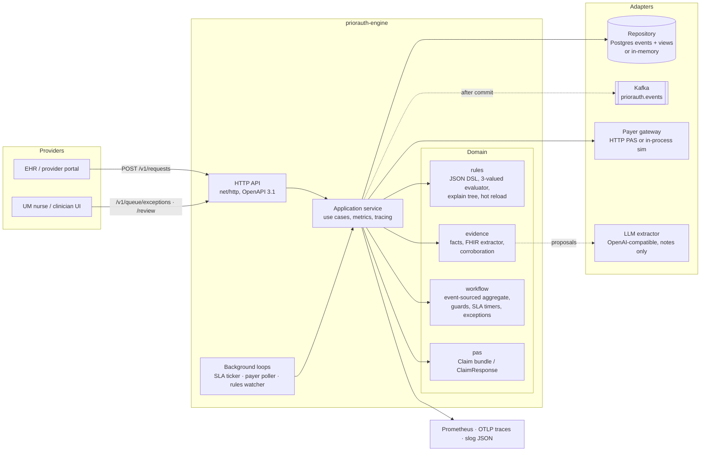
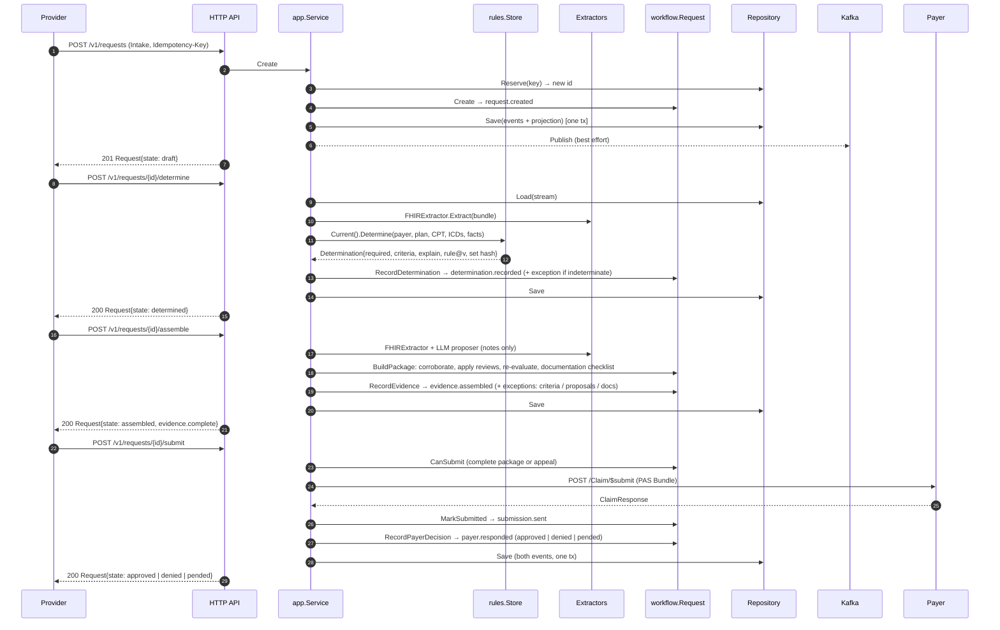
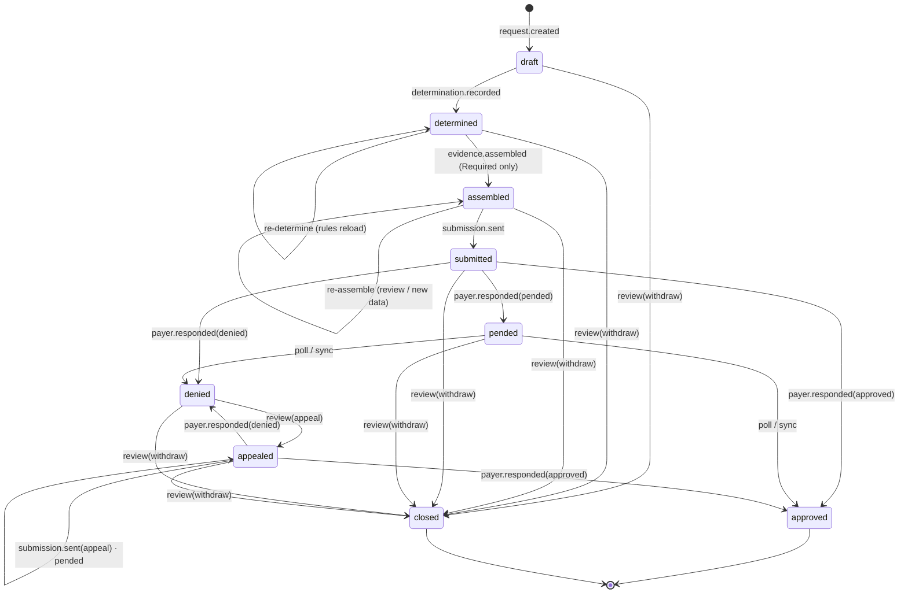

# Architecture

## Containers

Rules of the shape:

- `internal/domain/*` is pure: no I/O, deterministic, table-tested, ≥ 85% covered.
- `internal/app` is the only package that touches both domain and ports.
- `internal/adapters/*` implement `internal/ports`; every port has an in-memory adapter, so
  `make run` and the whole test suite need no infrastructure.

## Hot path: create → determine → assemble → submit

## State machine

Guards live in `internal/domain/workflow/request.go` (`RecordDetermination`,
`CanAssemble`, `CanSubmit`, `RecordPayerDecision`, `Review`). Exceptions are
raised/resolved by the same commands so the queue always mirrors the state.

## Data

| Table | Purpose |
| --- | --- |
| `request_events` | append-only stream, `UNIQUE (request_id, seq)` is the concurrency guard |
| `request_views` | JSONB projection of `workflow.Request`, indexed by state/payer/updated_at |
| `idempotency_keys` | key → request id |
| `schema_migrations` | applied embedded migrations |

## Scaling model

Stateless replicas behind a Service; the HPA scales on CPU/memory. Writes to
one request are serialised by optimistic concurrency, so many replicas can
run the SLA and poll loops concurrently (a loser gets `ErrConcurrency` and
skips). Postgres is the write bottleneck; at ~50 events per request and a
few KB per event, 10k requests/day is well under a single instance.
